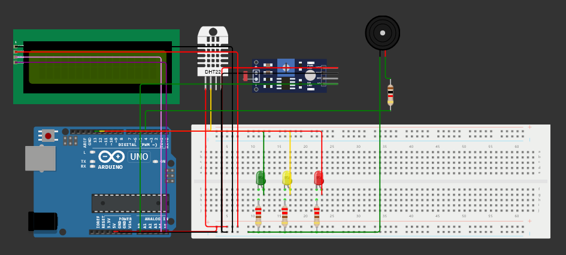

# Projeto Vinheria Agnello
#### Este é um projeto de Edge computing desenvolvido para auxiliar o gerenciamento da qualidade dos vinhos da Vinheria Agnello. Esse circuito tem como intuito relatar a luminosidade, temperatura e umidade do ambiente, mostrando quando o ambiente está em condições irregulares, ajudando na tomada de providências necessárias para manter a qualidade dos produtos.
#### Para isso, escolhemos o sensor integrado DHT22 para ler a temperatura e umidade do ambiente. Utilizamos um display LCD para mostrar os valores, além da sinalização com LEDs e o Buzzer quanto a luminosidade.

Simulação Wokwi: https://wokwi.com/projects/397084276023000065

Tecnologias utilizadas:
 

## Integrantes do projeto
RM   | Nome
------- | ------
555111 | Milena Garcia
556262 | Steffany Medeiros
556712 | Gustavo Henrique
556908 | Vinicius Henrique
