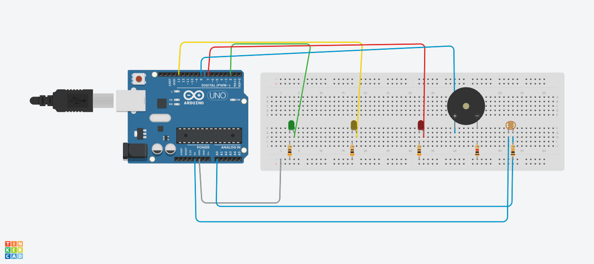

# Projeto Vinheria Angello
### Este é o priemiro passo deste projeto. Um sensor recebe informações sobre a luminosidade do ambiente, e caso esteja inadequada para manter a integridade dos vinhos da Vinheria Angello um apito soara para alertar.

## Integrantes do projeto
RM   | Nome
------- | ------
555111 | Milena Garcia
556262 | Steffany Medeiros
556712 | Gustavo Henrique
556908 | Vinicius Henrique
